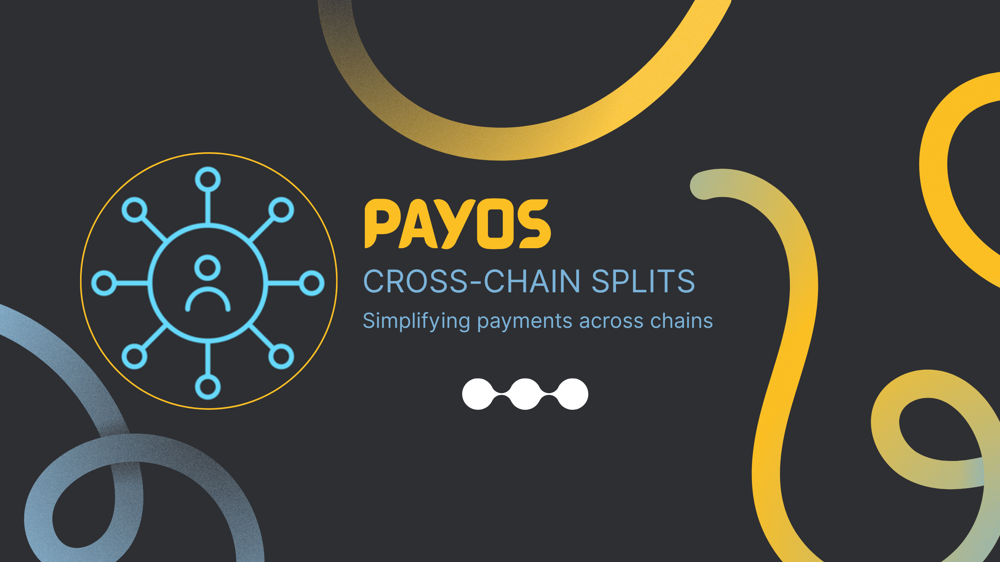

# PayOS - Cross-Chain Bill Splitting Platform

[](https://soliditylang.org/)
[](https://nextjs.org/)
[](https://www.typescriptlang.org/)

A decentralized cross-chain bill splitting application that enables groups to split expenses across Ethereum, Arbitrum, Optimism, and Base networks. Built with Foundry smart contracts, Next.js frontend, and integrated with Avail Nexus SDK and PYUSD.

<div align="center">
  
</div>

## 📖 Overview

PayOS solves the problem of splitting bills and expenses in a multi-chain world. Whether you're splitting a dinner bill, sharing subscription costs, or coordinating group expenses, PayOS makes it simple and trustless.

### Key Features

✅ **Cross-Chain Contributions** - Contributors can send funds from any supported blockchain  
✅ **Multi-Token Support** - Settle in ETH, USDC, or PYUSD  
✅ **Deterministic Deployment** - Same contract address (`0x3bdeD6E96eeeB7858701A0291dBA9A84c8b9D801`) across all chains  
✅ **Automatic Settlement** - Funds automatically distribute when target is reached  
✅ **Zero Platform Fees** - Only pay for gas  
✅ **Trustless & Transparent** - All transactions verifiable on-chain  

### How It Works

1. **Create a Split**: Define recipients, contributors, target amount, and chain
2. **Add Contributors**: Specify custom amounts for each person (up to 10 contributors)
3. **Cross-Chain Contributions**: Contributors can pay from any chain using any supported token
4. **Automatic Bridge & Settle**: Avail Nexus SDK handles cross-chain transfers automatically
5. **Instant Settlement**: When target is reached, funds transfer to recipient immediately

## 🏗️ Project Structure

```
payos/
├── payos-contracts/          # Smart Contracts (Solidity + Foundry)
│   ├── src/
│   │   └── PayosSplit.sol   # Main contract
│   ├── script/
│   │   └── DeployPayosSplit.s.sol
│   ├── bash-scripts/        # Deployment & verification scripts
│   └── README.md
│
└── payos-ui/                 # Frontend (Next.js + React)
    ├── app/                  # Next.js App Router
    ├── components/           # React components
    ├── hooks/                # Custom React hooks
    ├── lib/                  # Utilities & configs
    ├── database/             # MongoDB integration
    └── README.md
```

## 🚀 Quick Start

### Frontend Setup

```bash
cd payos-ui
yarn install
yarn dev
```

Visit `http://localhost:3000`

### Smart Contract Setup

```bash
cd payos-contracts
forge install
forge build
./bash-script/deploy_payos_split.sh
```

## 📚 Documentation

- **[Smart Contracts README](./payos-contracts/README.md)** - Contract architecture, deployment, and functions
- **[Frontend README](./payos-ui/README.md)** - UI setup, components, and integration details

## 🛠️ Technology Stack

### Smart Contracts
- **Solidity 0.8.20** - Smart contract language
- **Foundry** - Development framework
- **OpenZeppelin** - Security libraries (Ownable, ReentrancyGuard, SafeERC20)
- **CREATE2** - Deterministic deployment

### Frontend
- **Next.js 15** - React framework with App Router
- **React 19** - UI library
- **TypeScript** - Type safety
- **Privy** - Wallet authentication
- **Wagmi + Viem** - Ethereum interactions
- **MongoDB** - Data persistence
- **Tailwind CSS** - Styling

### Integrations
- **Avail Nexus SDK** - Cross-chain bridging and execution
- **PYUSD (PayPal USD)** - Currency support across all chains

## 🌐 Supported Networks

| Chain | Network | Chain ID | Contract Address |
|-------|---------|----------|------------------|
| Ethereum Sepolia | eth-sepolia | 11155111 | [0x3bdeD6E96eeeB7858701A0291dBA9A84c8b9D801](https://sepolia.etherscan.io/address/0x3bdeD6E96eeeB7858701A0291dBA9A84c8b9D801) |
| Arbitrum Sepolia | arb-sepolia | 421614 | [0x3bdeD6E96eeeB7858701A0291dBA9A84c8b9D801](https://sepolia.arbiscan.io/address/0x3bdeD6E96eeeB7858701A0291dBA9A84c8b9D801) |
| Optimism Sepolia | op-sepolia | 11155420 | [0x3bdeD6E96eeeB7858701A0291dBA9A84c8b9D801](https://sepolia-optimism.etherscan.io/address/0x3bdeD6E96eeeB7858701A0291dBA9A84c8b9D801) |
| Base Sepolia | base-sepolia | 84532 | [0x3bdeD6E96eeeB7858701A0291dBA9A84c8b9D801](https://sepolia.basescan.org/address/0x3bdeD6E96eeeB7858701A0291dBA9A84c8b9D801) |

## 💰 Supported Tokens

- **ETH** - Native Ethereum
- **USDC** - USD Coin (Circle)
- **PYUSD** - PayPal USD

All tokens configured with addresses on each supported chain.

## 🔒 Security

- OpenZeppelin audited libraries
- ReentrancyGuard protection
- Access control (owner-only for critical functions)
- SafeERC20 for secure token transfers
- Custom errors for gas efficiency
- Input validation throughout

**Built with ❤️ for Splitter & Contributors - Making cross-chain bill splitting simple, secure, and trustless**
